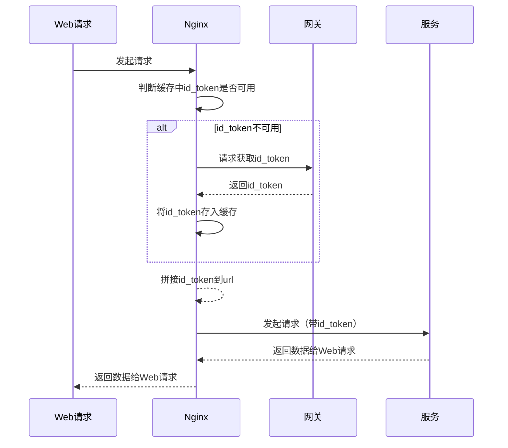

# 云盾IDAAS认证 ApiIdToken 自动处理模块
## 简介
此模块为了应对最近推广的 云盾IDAAS认证（服务器部署在内网隔离，公网对内的所有http请求都必须在url中增加id_token参数）的要求，在尽量不更改程序的前提下，利用 openresty （nginx + lua） 中间件实现自动获取id_token、自动添加url参数
- 云盾IDAAS认证
- id_token
- openresty-1.21.4.3-win64
- nginx
- lua 
  
## 流程

## 使用方法
1. 下载 openresty
2. 将本项目的文件拷贝到 openresty 根目录
3. 修改 conf\nginx.conf
   ```nginx   
    # 在http域内添加
    include idaas/*.conf;  
   ```
4. 修改 lualib\idaas\idToken_test.lua 中的配置信息
4. 修改 conf\idaas\idToken test.conf 中的配置信息：代理地址、DNS解析等
5. 启动测试


## 技术依赖
- openresty
- lua
  
## 信息准备
管理人员会预先分配如下信息：
```js
网关地址：https://api.xxx.com:9000/xxxapi/xxxxx/xxxxx?id_token=

id_token请求地址：https://api.xxx.com:9000/api/xxxxxxxx
id_token请求令牌：
{
	"appKey":"",
	"appSecret":""
}
```
## 模块
- idToken_core.lua  :   核心模块，集成了自动获取id_Token、存储缓存、追加在url参数中
- idToken_remove.lua    ：  移除url中的id_Token
- idToken_test.lua  :    测试项目的配置，预定义了配置信息
  
- idToken_test.conf ：测试
- lua_core.conf ：公共的conf配置


